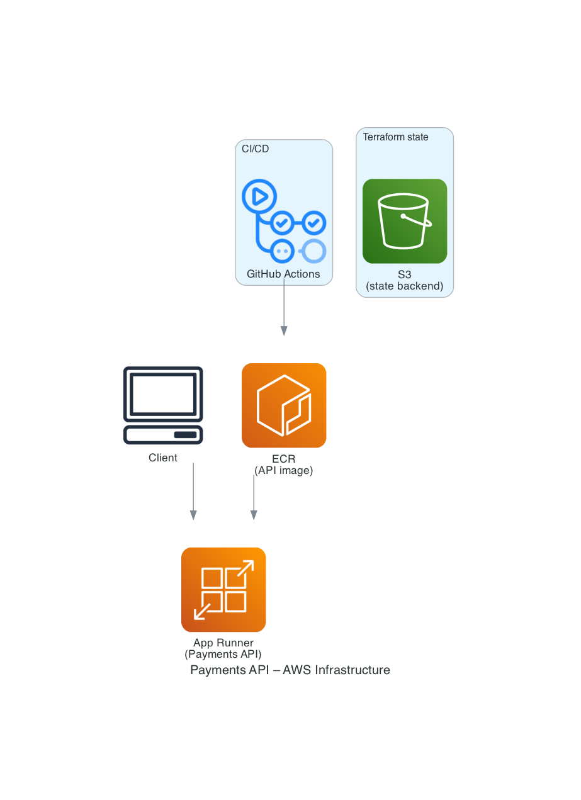

# Cross-Border Payments API (USDC → COP)

Take-home: Platform Engineer (Payments API Infrastructure). API en NestJS con variables de entorno, infraestructura en **Terraform con módulos**, dos ambientes (**dev** y **prod**) y despliegue en **AWS App Runner**.

## Quick Start

```bash
# API en local (usa .env o variables de entorno)
cd api && npm install && cp .env.example .env && npm run start:dev

# API en Docker
docker compose up --build

# Disparar un transfer (script opcional)
./scripts/trigger-transfer.sh http://localhost:8080 100 vendorA 0x1234567890abcdef
```

## Variables de entorno (API)

La API usa `@nestjs/config` (ConfigModule) y lee:

| Variable   | Descripción              | Por defecto    |
|-----------|---------------------------|----------------|
| `NODE_ENV`| Entorno (development/production) | - |
| `PORT`    | Puerto HTTP               | 8080           |
| `API_KEY`| (Opcional) Clave para auth interno | - |

En App Runner estas variables se configuran en Terraform por ambiente (`runtime_environment_variables` y opcionalmente `runtime_environment_secrets` para Secrets Manager/SSM). Ver `api/.env.example`.

## Estructura del repo

| Ruta | Descripción |
|------|-------------|
| `api/` | NestJS: `POST /transfer`, `/health`, `/metrics`; variables de entorno vía ConfigModule |
| **`infra/`** | Infraestructura como código (ver [infra/README.md](infra/README.md)) |
| **`diagram-aws/`** | Diagrama de infraestructura AWS como código (Python + [diagrams](https://github.com/mingrammer/diagrams)); ver [diagram-aws/README.md](diagram-aws/README.md) |
| `infra/terraform/modules/` | Módulos Terraform: **ecr**, **app-runner** |
| `infra/terraform/environments/dev` | Ambiente **dev** (ECR `payments-api-dev`, App Runner, tfvars) |
| `infra/terraform/environments/prod` | Ambiente **prod** (ECR `payments-api-prod`, App Runner, lifecycle policy) |
| `.github/workflows/ci.yml` | CI: tests; deploy a **dev** (push a main) o **prod** (workflow_dispatch) |
| `scripts/deploy-tests.sh` | Tests de humo post-despliegue |
| `scripts/destroy-local.sh` | Destruir infra del ambiente en local (dev/prod) |
| `scripts/terraform-validate.sh` | Valida Terraform en dev y prod |
| `ARCHITECTURE.md` | Diseño, extensibilidad de vendors, flujo txhash |
| `SOC2.md` | IAM, cifrado, auditoría, respuesta a incidentes |

## Infraestructura (`infra/`)



Toda la infra está en **`infra/`**. Hoy solo hay Terraform:

- **`infra/terraform/`**: IaC para AWS App Runner + ECR, con dos ambientes.
  - **Módulos**: `ecr` (repositorio de imágenes), `app-runner` (servicio, IAM, variables de entorno).
  - **Dev**: `ecr_repository_name = payments-api-dev`, `NODE_ENV=development`, auto-deploy activado.
  - **Prod**: `ecr_repository_name = payments-api-prod`, `NODE_ENV=production`, lifecycle “keep last 10 images”.

Comandos (desde la raíz del repo):

```bash
# Dev
cd infra/terraform/environments/dev
terraform init && terraform apply -var-file=terraform.tfvars

# Prod
cd infra/terraform/environments/prod
terraform init && terraform apply -var-file=terraform.tfvars
```

Detalles, variables de entorno en App Runner, backend S3 y despliegue de imágenes: **[infra/terraform/README.md](infra/terraform/README.md)**.

## CI/CD

- **Push a main**: tests (lint, unit, e2e) y deploy a **dev** (build → push ECR → Terraform apply → tests de despliegue).
- **Deploy a prod**: ejecutar el workflow manualmente (`workflow_dispatch`) y elegir `environment: prod`. Requiere secrets de AWS (OIDC `AWS_ROLE_ARN_DEV` / `AWS_ROLE_ARN_PROD` o access key/secret).

## API

- **POST /transfer**  
  Body: `{ "amount": number, "vendor": "vendorA" | "vendorB", "txhash": string }`  
  Valida `txhash` (mock: `0x` + longitud ≥ 10 → confirmed), reenvía al vendor y devuelve `{ txhashStatus, vendorResponse? }`.
- **GET /health** — Liveness/readiness.
- **GET /metrics** — Métricas Prometheus.

## Pruebas

### NestJS (unitarias)
- `npm run test` — pruebas unitarias (Jest).
- Cobertura: `BlockchainService`, `TransferService`, `TransferController`, `VendorRegistryService`, `VendorAAdapter`, `VendorBAdapter`, `MetricsService`, `AppController`.

### Terraform
- `./scripts/terraform-validate.sh` — valida sintaxis y módulos en `environments/dev` y `environments/prod` (sin AWS).
- El pipeline de CI ejecuta este script en cada push/PR.

## Vendors (mock)

- **vendorA**: `{ "status": "success" }`
- **vendorB**: `{ "status": "pending" }`  
Para **vendorC**: implementar `IVendorAdapter` y registrarlo en el módulo (ver `vendor-c.example.adapter.ts`).

## Documentación

| Documento | Contenido |
|-----------|-----------|
| [MANUAL.md](MANUAL.md) | Comandos rápidos: levantar API, llamar endpoints, tests, Terraform |
| [infra/README.md](infra/README.md) | Índice de la carpeta infra |
| [infra/terraform/README.md](infra/terraform/README.md) | Terraform: módulos, ambientes dev/prod, variables, despliegue de imágenes |
| [ARCHITECTURE.md](ARCHITECTURE.md) | Diseño del sistema, extensibilidad de vendors, flujo txhash, DORA |
| [SOC2.md](SOC2.md) | Alineación SOC 2: IAM, cifrado, auditoría, respuesta a incidentes |
